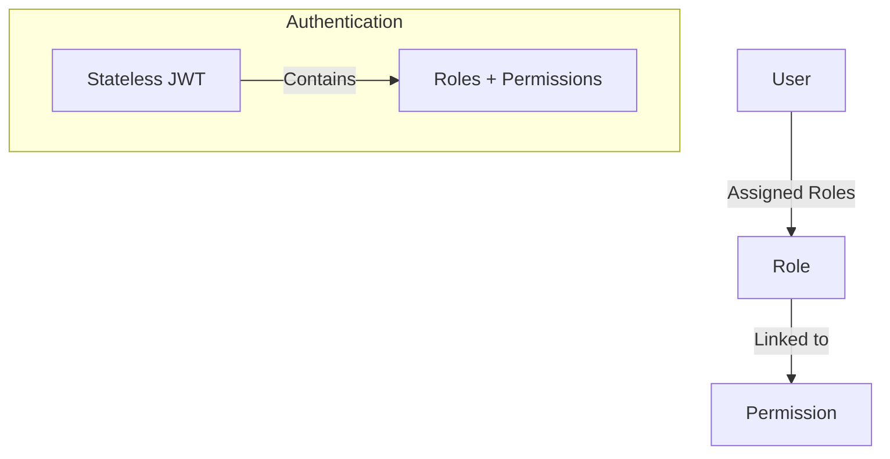

# Single-Tenant Role-Based Access Control (RBAC) Implementation Guide

This guide provides a comprehensive blueprint to replicate and build a standard, single-tenant Role-Based Access Control (RBAC) system in a node-based TypeScript application.

---

## 1. Architectural Overview

The system features a standard **Single-Tenant RBAC model** where users are assigned one or more roles, and each role is linked to a set of permissions.



### Key Design Principles:
1. **Stateless Middleware Authorization**: Permission checks are performed against the claims in the decrypted JSON Web Token (JWT) at the route level. This ensures sub-millisecond route validation by avoiding database queries on every HTTP request.
2. **Simple Schema Relationship**:
   - A User can have multiple Roles (Many-to-Many).
   - A Role can have multiple Permissions (Many-to-Many).
3. **Stale Claim Invalidation**: Includes a `permissionsVersion` timestamp claim in the JWT. If a user's role assignment or permissions are updated, incrementing the version in the database invalidates older JWTs, forcing clients to re-authenticate or refresh.

---

## 2. Database Schema (Drizzle ORM)

The database consists of 4 core tables: `roles`, `permissions`, `role_permissions`, and `user_roles`. 

```typescript
import {
  pgTable,
  uuid,
  varchar,
  timestamp,
  index,
  primaryKey,
  pgEnum,
} from "drizzle-orm/pg-core";

// 1. Categories for grouping permissions
export const permissionCategoryEnum = pgEnum("permission_category", [
  "users",
  "roles",
  "appointments",
  "billing",
  "reports",
  "system",
]);

// 2. Roles Table
export const roles = pgTable(
  "roles",
  {
    id: uuid("id").primaryKey().defaultRandom(),
    name: varchar("name", { length: 100 }).notNull().unique(), // Unique system-wide name
    description: varchar("description", { length: 500 }),
    createdAt: timestamp("created_at", { withTimezone: true }).defaultNow().notNull(),
    updatedAt: timestamp("updated_at", { withTimezone: true }).defaultNow().notNull(),
  }
);

// 3. Permissions Table (System-defined, Immutable)
export const permissions = pgTable(
  "permissions",
  {
    id: uuid("id").primaryKey().defaultRandom(),
    key: varchar("key", { length: 100 }).notNull().unique(), // e.g., "users:create"
    name: varchar("name", { length: 100 }).notNull(),
    description: varchar("description", { length: 500 }),
    category: permissionCategoryEnum("category").notNull(),
    createdAt: timestamp("created_at", { withTimezone: true }).defaultNow().notNull(),
  },
  (t) => ({
    keyIdx: index("permissions_key_idx").on(t.key),
    categoryIdx: index("permissions_category_idx").on(t.category),
  })
);

// 4. Role <-> Permission Association (Many-to-Many Join Table)
export const rolePermissions = pgTable(
  "role_permissions",
  {
    roleId: uuid("role_id")
      .notNull()
      .references(() => roles.id, { onDelete: "cascade" }),
    permissionId: uuid("permission_id")
      .notNull()
      .references(() => permissions.id, { onDelete: "restrict" }),
    createdAt: timestamp("created_at", { withTimezone: true }).defaultNow().notNull(),
  },
  (t) => ({
    pk: primaryKey({ columns: [t.roleId, t.permissionId] }),
    roleIdx: index("role_permissions_role_idx").on(t.roleId),
    permissionIdx: index("role_permissions_permission_idx").on(t.permissionId),
  })
);

// 5. User <-> Role Association (Many-to-Many Join Table)
export const userRoles = pgTable(
  "user_roles",
  {
    id: uuid("id").primaryKey().defaultRandom(),
    userId: uuid("user_id").notNull(), // References your users table
    roleId: uuid("role_id")
      .notNull()
      .references(() => roles.id, { onDelete: "restrict" }),
    assignedAt: timestamp("assigned_at", { withTimezone: true }).defaultNow().notNull(),
    assignedBy: uuid("assigned_by"),
  },
  (t) => ({
    userRoleUnique: index("user_role_unique_idx").on(t.userId, t.roleId),
    userIdx: index("user_roles_user_idx").on(t.userId),
    roleIdx: index("user_roles_role_idx").on(t.roleId),
  })
);
```

---

## 3. Permissions Catalog & Seeding

Define your application permissions as code constants, and load them into the database using a seeding script.

### Permissions Definition (`permissions.seed.ts`)
```typescript
export const PERMISSIONS = [
  // User Management
  { key: "users:view", name: "View Users", description: "View user list and details", category: "users" },
  { key: "users:create", name: "Create Users", description: "Create new users", category: "users" },
  { key: "users:update", name: "Update Users", description: "Update user info", category: "users" },
  { key: "users:delete", name: "Delete Users", description: "Delete users", category: "users" },
  { key: "users:manage_roles", name: "Manage User Roles", description: "Assign/revoke roles from users", category: "users" },

  // Role Management
  { key: "roles:view", name: "View Roles", description: "View role list and details", category: "roles" },
  { key: "roles:create", name: "Create Roles", description: "Create new roles", category: "roles" },
  { key: "roles:update", name: "Update Roles", description: "Update role permissions", category: "roles" },
  { key: "roles:delete", name: "Delete Roles", description: "Delete roles from the system", category: "roles" },
] as const;

export const DEFAULT_ROLES = {
  ADMIN: {
    name: "Admin",
    description: "Full system administrator - can manage everything",
    permissions: [
      "users:view", "users:create", "users:update", "users:delete", "users:manage_roles",
      "roles:view", "roles:create", "roles:update", "roles:delete",
    ],
  },
  MEMBER: {
    name: "Member",
    description: "Standard staff user",
    permissions: [
      "users:view",
    ],
  },
} as const;
```

### Seeding Script (`seed-rbac.ts`)
```typescript
import { db } from "./db";
import { permissions, roles, rolePermissions } from "./schema";
import { PERMISSIONS, DEFAULT_ROLES } from "./permissions.seed";
import { eq, and } from "drizzle-orm";

export async function seedRBAC() {
  console.log("🌱 Seeding permissions...");
  for (const perm of PERMISSIONS) {
    const [existing] = await db.select().from(permissions).where(eq(permissions.key, perm.key)).limit(1);
    if (!existing) {
      await db.insert(permissions).values(perm);
    }
  }

  console.log("🌱 Seeding default roles...");
  for (const [key, data] of Object.entries(DEFAULT_ROLES)) {
    let [role] = await db.select().from(roles).where(eq(roles.name, data.name)).limit(1);
    if (!role) {
      [role] = await db.insert(roles).values({ name: data.name, description: data.description }).returning();
    }

    for (const permKey of data.permissions) {
      const [permission] = await db.select().from(permissions).where(eq(permissions.key, permKey)).limit(1);
      if (!permission) continue;

      const [link] = await db.select().from(rolePermissions).where(
        and(eq(rolePermissions.roleId, role.id), eq(rolePermissions.permissionId, permission.id))
      ).limit(1);

      if (!link) {
        await db.insert(rolePermissions).values({ roleId: role.id, permissionId: permission.id });
      }
    }
  }
  console.log("✅ Seed complete.");
}
```

---

## 4. Stateless JWT Integration

Extract the user's combined roles and permissions when creating their access token.

### JWT Payload Structure
```typescript
import jwt from "jsonwebtoken";

export interface JwtPayloadRBAC {
  userId: string;
  email: string;
  roles: string[];
  permissions: string[];
  permissionsVersion: number; // Increment in DB on updates to invalidate old JWTs
}

export const signAccessToken = (payload: Omit<JwtPayloadRBAC, "iat" | "exp">): string => {
  return jwt.sign(payload, process.env.JWT_SECRET!, { expiresIn: "1d" });
};

export const verifyAccessToken = (token: string): JwtPayloadRBAC => {
  return jwt.verify(token, process.env.JWT_SECRET!) as JwtPayloadRBAC;
};
```

---

## 5. Authorization Middlewares

Add these Express middlewares to validate user permissions directly from the JWT.

```typescript
import type { Request, Response, NextFunction } from "express";
import { type JwtPayloadRBAC } from "./jwt-rbac";

declare global {
  namespace Express {
    interface Request {
      user?: JwtPayloadRBAC;
    }
  }
}

// 1. Require a single permission
export const authorize = (permission: string) => {
  return (req: Request, res: Response, next: NextFunction): void => {
    if (!req.user || !req.user.permissions.includes(permission)) {
      res.status(403).json({ error: "Forbidden: Missing permission: " + permission });
      return;
    }
    next();
  };
};

// 2. Require at least one permission from a list (OR logic)
export const authorizeAny = (required: string[]) => {
  return (req: Request, res: Response, next: NextFunction): void => {
    if (!req.user) {
      res.status(401).json({ error: "Unauthorized" });
      return;
    }
    const hasAny = required.some((p) => req.user!.permissions.includes(p));
    if (!hasAny) {
      res.status(403).json({ error: "Forbidden: One of the required permissions is missing" });
      return;
    }
    next();
  };
};

// 3. Require all listed permissions (AND logic)
export const authorizeAll = (required: string[]) => {
  return (req: Request, res: Response, next: NextFunction): void => {
    if (!req.user) {
      res.status(401).json({ error: "Unauthorized" });
      return;
    }
    const missing = required.filter((p) => !req.user!.permissions.includes(p));
    if (missing.length > 0) {
      res.status(403).json({ error: "Forbidden: Missing permissions: " + missing.join(", ") });
      return;
    }
    next();
  };
};
```

---

## 6. Repository & Data Access Layer (`rbac.repository.ts`)

These methods load and manage roles and permissions dynamically.

```typescript
import { eq, and, inArray, count } from "drizzle-orm";
import { db } from "./db";
import { roles, permissions, userRoles, rolePermissions } from "./schema";

export const rbacRepository = {
  /**
   * Fetches roles and merged permissions associated with a user.
   */
  async getUserWithRolesAndPermissions(userId: string) {
    const roleRecords = await db
      .select({ role: roles })
      .from(userRoles)
      .innerJoin(roles, eq(userRoles.roleId, roles.id))
      .where(eq(userRoles.userId, userId));

    const roleList = roleRecords.map((r) => r.role);
    if (roleList.length === 0) {
      return { roles: [], permissions: [] };
    }

    const roleIds = roleList.map((r) => r.id);
    const permissionRecords = await db
      .select({ permission: permissions })
      .from(rolePermissions)
      .innerJoin(permissions, eq(rolePermissions.permissionId, permissions.id))
      .where(inArray(rolePermissions.roleId, roleIds));

    // Deduplicate permissions by key
    const uniquePermissions = Array.from(
      new Map(permissionRecords.map((p) => [p.permission.key, p.permission])).values()
    );

    return { roles: roleList, permissions: uniquePermissions };
  },

  /**
   * Creates a role and attaches its list of permissions atomically
   */
  async createRole(name: string, description: string | undefined, permissionIds: string[]) {
    return db.transaction(async (tx) => {
      const [role] = await tx.insert(roles).values({ name, description }).returning();

      if (permissionIds.length > 0) {
        await tx.insert(rolePermissions).values(
          permissionIds.map((pId) => ({ roleId: role.id, permissionId: pId }))
        );
      }
      return role;
    });
  },

  /**
   * Counts users currently assigned to this role
   */
  async countAssignments(roleId: string): Promise<number> {
    const [{ value }] = await db
      .select({ value: count() })
      .from(userRoles)
      .where(eq(userRoles.roleId, roleId));
    return Number(value);
  },
};
```

---

## 7. Business Logic (Service Layer)

Enforces standard safety checks at the business layer:
- **Dependency Guard**: Do not allow deleting roles if users are still assigned to them.
- **Permission Validator**: Ensure all assigned permission IDs are valid.
- **Name Conflict Guard**: Avoid creating or renaming roles to duplicate existing role names.

```typescript
import { db } from "./db";
import { roles } from "./schema";
import { eq } from "drizzle-orm";
import { rbacRepository } from "./rbac.repository";

export const roleService = {
  async deleteRole(id: string) {
    const role = await db.select().from(roles).where(eq(roles.id, id)).limit(1).then(r => r[0]);
    if (!role) throw new Error("Role not found");

    // Guard: Prevent deletion of role if in use
    const assignmentsCount = await rbacRepository.countAssignments(id);
    if (assignmentsCount > 0) {
      throw new Error(`Cannot delete role: Assigned to ${assignmentsCount} user(s)`);
    }

    await db.delete(roles).where(eq(roles.id, id));
  }
};
```

---

## 8. Express Routes Implementation Example

Endpoints to manage your Roles and Users' Role mappings.

```typescript
import { Router } from "express";
import { authorize } from "./authorize.middleware";
import { rbacRepository } from "./rbac.repository";
import { roleService } from "./role.service";
import { db } from "./db";
import { permissions } from "./schema";

const router = Router();

// Retrieve all available permissions for building role-creator screens
router.get("/permissions", authorize("roles:view"), async (req, res) => {
  const allPerms = await db.select().from(permissions);
  res.json(allPerms);
});

// Create custom role
router.post("/", authorize("roles:create"), async (req, res) => {
  const { name, description, permissionIds } = req.body;
  try {
    const newRole = await rbacRepository.createRole(name, description, permissionIds);
    res.status(201).json(newRole);
  } catch (err: any) {
    res.status(400).json({ error: err.message });
  }
});

// Delete role
router.delete("/:id", authorize("roles:delete"), async (req, res) => {
  try {
    await roleService.deleteRole(req.params.id);
    res.json({ success: true });
  } catch (err: any) {
    res.status(400).json({ error: err.message });
  }
});
```
