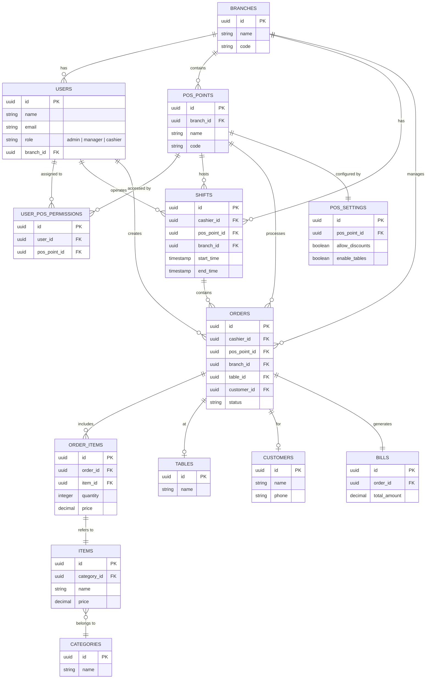

# Restaurant POS System - Entity Relationship Diagram (ERD)

This document provides a visual representation and detailed description of the backend database schema, with a focus on Role-Based Access Control (RBAC) implementation.

## Database Schema (Mermaid Diagram)

## RBAC Implementation Details

The current schema supports RBAC through several key fields and tables:

### 1. User Roles
- **Table:** `users`
- **Field:** `role`
- **Values:** Currently defined as `admin`, `manager`, or `cashier`.
- **Scope:** 
    - `admin`: Global access (usually `branch_id` is null).
    - `manager`: Access to specific branch data.
    - `cashier`: Limited to creating orders and managing their own shifts.

### 2. POS-Level Permissions
- **Table:** `user_pos_permissions`
- **Purpose:** Maps specific `users` to specific `pos_points`. 
- **Use Case:** Even if a user is a `cashier` in a branch, they may only be allowed to log into specific terminals (e.g., "Main Counter" but not "Bar Terminal").

### 3. Branch Isolation
- **Field:** `branch_id` (present in `users`, `pos_points`, `shifts`, `orders`, etc.)
- **Purpose:** Ensures data isolation between different restaurant branches. 
- **RBAC Rule:** Users (except global admins) should only be able to see/modify data associated with their `branch_id`.

### 4. Shift-Based Access
- **Table:** `shifts`
- **Purpose:** Tracks when a `cashier` is active.
- **RBAC Potential:** Orders and cash operations can be restricted to users with an active shift on a specific `pos_point`.

## Key Relationships for RBAC Logic

- **User -> Branch:** Determines the data partition the user can access.
- **User -> Role:** Determines the actions (CRUD) the user can perform.
- **User -> POS Point (via user_pos_permissions):** Determines which hardware/terminal the user can operate.
- **Order -> Cashier/POS/Branch:** Provides audit trails for permission-based actions.
